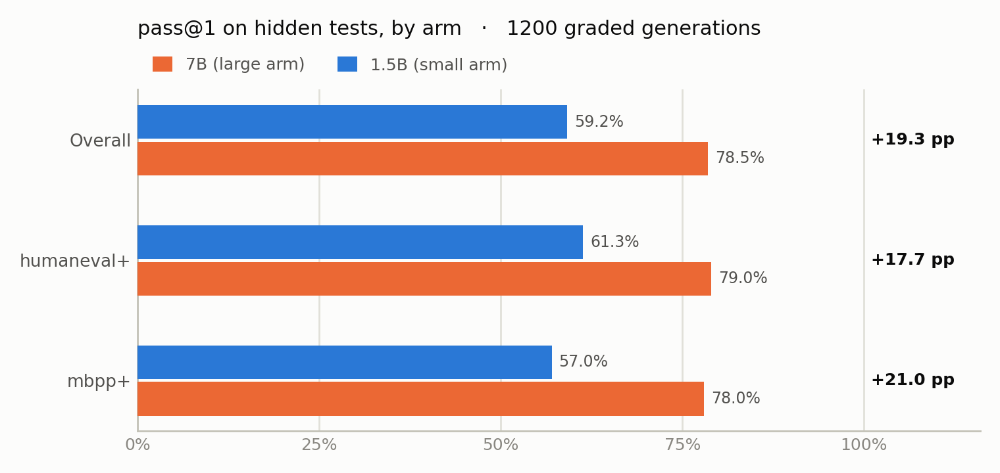
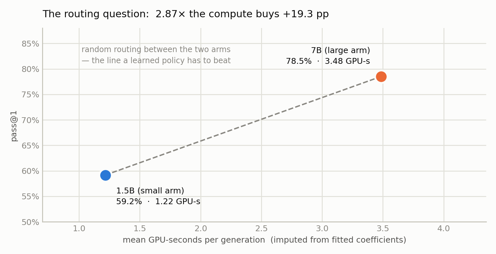
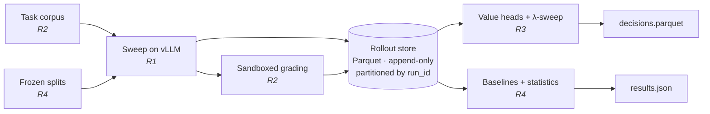

# Cost-Aware LLM Orchestration

A learned policy decides **which model to spend on** — answer with a small model,
escalate to a large one, or retry with repair — trading accuracy against compute
and latency.

Correctness is decided by **executing unit tests in a sandbox**, never by asking
another model. Every number is reproducible from a `run_id`.

`632 tests` · `Python 3.12` · `vLLM` · `Docker-sandboxed grading` · Phase 0

---

## First measured result

The pilot ran on 13 Aug 2026: **1,200 generations, swept on vLLM and graded in
1,200 containers.** Both figures below are rendered from that run by
[`docs/assets/make_charts.py`](./docs/assets/make_charts.py) — measured, not
illustrative.

<picture>
  <source media="(prefers-color-scheme: dark)" srcset="./docs/assets/accuracy-by-arm-dark.png">
  
</picture>

The arms are differentiated by **19.3 pp**, clearing Phase 0's ≥8 pp gate. The gap
holds independently on both datasets, so it is a model-scale effect rather than one
dataset carrying it.

That is only half the question. The project exists because the accurate arm is also
the expensive one:

<picture>
  <source media="(prefers-color-scheme: dark)" srcset="./docs/assets/cost-accuracy-dark.png">
  
</picture>

**2.87× the compute buys +19.3 pp.** The dashed line is what random routing between
the arms achieves; a learned policy has to beat it, not merely land on it.

| | |
|---|---|
| Run | `2026-08-13-c76a55d-4f4767` — sealed, publishable |
| Generation | 1,200 rows (200 tasks × 2 arms × 3 seeds), 0 failed, 1.0% truncated |
| Grading | 1,200 Docker containers, 826 solved, 0.25% flagged for reward hacking |
| Cost model | R² = 0.9994 (1.5B) and 1.0000 (7B), out-of-sample |

---

## The claim being tested

Routing between a cheap and an expensive model beats always using either one, at
matched cost.

The honest version has to beat one specific baseline: **`verifier_gated_cascade`** —
run the small model, execute the visible tests, escalate only on failure. It is
strong because *observing* failure beats *predicting* it, so it is in the baseline
set from day one.

The central question is where in the pipeline the signal lives:

| Decision point | Information available | Target AUC |
|---|---|---|
| **D0** — before generating | prompt only | 0.60 – 0.68 |
| **D1** — after generating | prompt + candidate code + visible-test outcome | 0.80 – 0.90 |

That asymmetry drives the architecture. If `AUC_D1 < 0.75` the premise is false and
the project stops — that gate is in [ROADMAP.md](./docs/ROADMAP.md).

Nine baselines form a **capacity ladder**, each varying one thing from the rung
above, so a gap attributes to a cause. Two adjacent comparisons carry the result:
`heuristic_route → learned_D0` isolates **learning**, and `learned_D0 → learned_D1`
isolates **information**. The heuristic is tuned as hard as the policy is — a
baseline tuned less than the method is a strawman. **If the tuned heuristic wins,
that is the finding.**

---

## How it fits together



Two properties make this work as a four-person project.

**Only R1 needs GPUs; only R2 needs sandboxing.** R3 and R4 are never blocked on
hardware.

**The architecture is log once, replay many times.** Rollouts are swept ahead of
time, so every policy, baseline and λ afterwards is arithmetic over Parquet on CPU.
No two models are ever resident together. That is why the cost of a run can be
re-imputed on new hardware without regenerating a single token.

---

## Quickstart

```sh
git clone https://github.com/Harsha-Kamaraj/Multi_LLM_Orchestration
cd Multi_LLM_Orchestration

git config core.hooksPath .githooks    # required — enforces commit rules
pip install -e .
```

Reproducing the GPU pilot additionally needs the serving stack — see
[`bench/setup_gpu_env.sh`](./bench/setup_gpu_env.sh), where every version pin is
recorded next to the failure it fixes.

```sh
orch-workers sweep --tasks data/tasks/pilot_200.jsonl --backend vllm_offline \
    --small Qwen/Qwen2.5-Coder-1.5B-Instruct --large Qwen/Qwen2.5-Coder-7B-Instruct
orch grade run --run-id <run_id> --tasks data/tasks/pilot_200.jsonl --backend docker
```

> **Docker is required for any graded number.** The subprocess backend exists for
> local iteration and must never produce a reported number.

---

## Repository map

| Role | Owner | Doc | Owns |
|---|---|---|---|
| R1 · Serving & Workers | Guru | [guru.md](./docs/guru.md) | The GPUs |
| R2 · Verifier & Data | Diya | [diya.md](./docs/diya.md) | Correctness |
| R3 · Policy & Learning | Harsha | [harsha.md](./docs/harsha.md) | The policy |
| R4 · Evaluation & Analysis | Vivian | [vivian.md](./docs/vivian.md) | The verdict |

Each role doc ends with a **"what you must not do"** list, stated from both sides on
purpose: R1's says *don't grade*, R2's says *don't parse raw output*.

Also: [ROADMAP.md](./docs/ROADMAP.md) for phases and gates ·
[CONTRIBUTING.md](./docs/CONTRIBUTING.md) for the commit rules, which are enforced
by a hook rather than by trust · [bench/](./bench/README.md) for the serving surface.

---

## Ground rules

- **Runs are immutable.** `run_id = {date}-{git_sha7}-{config_hash6}`. A run is
  invalid until its manifest is sealed; readers skip unsealed runs. A re-grade is a
  new `run_id`. Dirty worktrees stamp `-dirty` and are non-publishable.
- **Nothing reads "latest".** Every consumer pins an explicit `run_id`.
- **Hidden tests are labels, never features** — including transitively.
- **The test split is opened exactly once**, by R4, after the analysis is
  pre-registered.
- **No bare means.** Every reported number carries an interval. This is a merge
  blocker.

---

## Status — Phase 0

The pilot has run end to end: generated, graded, costed and schema-validated. **The
Phase 0 gate has still not passed** — one of its four quantities is measured.

| Gate quantity | Threshold | Measured |
|---|---|---|
| `A_large − A_small` | ≥ 8 pp | ✅ **19.33 pp** |
| `A_oracle − A_large` | ≥ 5 pp | ❌ needs R4's oracle study |
| `AUC_D0` | ≥ 0.65 | ❌ measurable — awaiting the graded store |
| `AUC_D1` | ≥ 0.75 | ❌ **hard stop if it fails** |

Both AUC quantities are one command away. R3's feature builders, value heads and
gate are built and green (`orch-policy gate`), and on synthetic fixtures they
recover `AUC_D0 = 0.65` and `AUC_D1 = 0.86`. What is missing is not code: `runs/`
is gitignored, so the graded pilot store has never been on R3's machine.

Outstanding: the graded store reaching R3, R4's frozen 1,000-task splits and
oracle-gap study, and CI. 983 tests pass with no GPU and no network — a
statement about the code, not about the claim this project exists to test.

---

## Stack

Qwen2.5-Coder (1.5B / 7B) on **vLLM** · Docker sandbox · scikit-learn + LightGBM
(CPU) · Parquet + DuckDB · SciPy / statsmodels

Deliberately **not** used: LangChain, LangGraph, CrewAI, AutoGen, a vector DB, or an
RL framework. The policy chooses among a handful of arms using a few dozen features
over ~1,000 tasks; a tabular model is the right tool until a measured gap says
otherwise.

Every result is **offline replay** — which is how routing research is normally done,
and is stated up front rather than discovered later.
